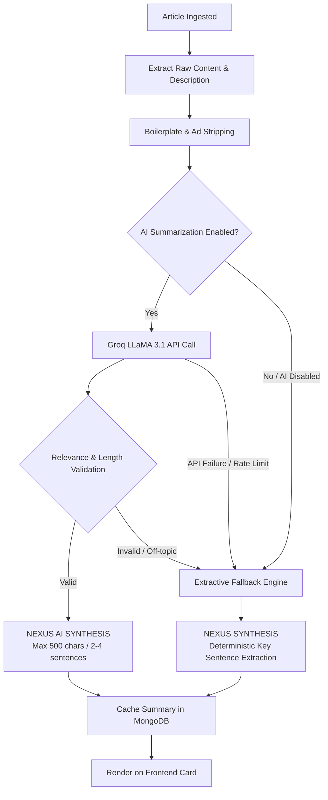
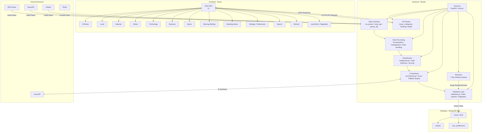
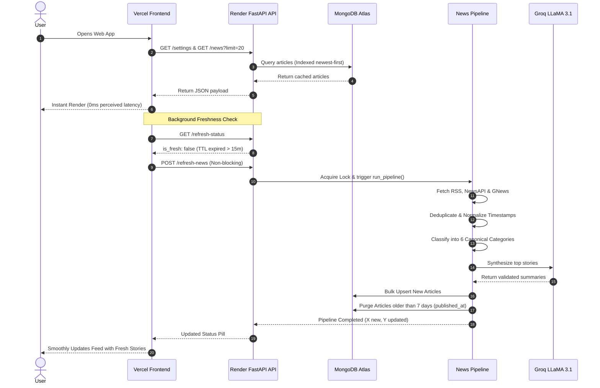

# 📰 Nexus News Agent

> A high-performance, real-time news aggregation and AI-assisted synthesis platform engineered with **FastAPI**, **MongoDB Atlas**, and modern responsive **Glassmorphism UI**.

[](https://nexus-news-agent.vercel.app/)
[](https://nexus-news-agent-api.onrender.com/)
[](https://www.mongodb.com/atlas)
[](https://python.org)
[](https://fastapi.tiangolo.com)

---

## 🌐 Deployment Links

- 🌐 **Live Demo (Frontend on Vercel)**: [https://nexus-news-agent.vercel.app/](https://nexus-news-agent.vercel.app/)
- ⚙️ **Production Backend (FastAPI on Render)**: [https://nexus-news-agent-api.onrender.com/](https://nexus-news-agent-api.onrender.com/)
- 🩺 **Production Health Check**: [https://nexus-news-agent-api.onrender.com/health](https://nexus-news-agent-api.onrender.com/health)

---

## 1. 📌 Project Overview

**Nexus News Agent** solves the modern problem of news fragmentation and cognitive overload. Readers are overwhelmed by hundreds of repetitive, sensationalized, or misclassified news feeds filled with advertising boilerplate and clickbait.

Nexus News Agent operates as an autonomous news intelligence hub that:
1. **Aggregates** real-time news across prominent national, global, regional, business, and tech news feeds (RSS, NewsAPI, GNews).
2. **Normalizes & Deduplicates** articles using canonical URL hashing and publication timestamp reconciliation.
3. **Classifies** news into 6 canonical categories using authoritative weighted contextual NLP to eliminate category leakage.
4. **Synthesizes** stories using **Groq LLaMA 3.1** models paired with strict relevance validation and deterministic extractive fallbacks.
5. **Maintains Freshness** with a non-blocking 15-minute TTL cache and concurrency-protected background refresh.
6. **Enforces a 7-Day Rolling Window** in **MongoDB Atlas**, automatically purging stale articles based strictly on original publication time.
7. **Delivers** an ultra-responsive, zero-dependency glassmorphism web interface with customizable reading density, category filtering, search, and morning briefings.

---

## 2. ✨ Features

- 📰 **Live Multi-Source Ingestion**: Pulls real news from RSS feeds, NewsAPI, and GNews with zero synthetic/fake stories.
- 🗂️ **6 Canonical Categories**: Dedicated feeds for **Local**, **National**, **Global**, **Technology**, **Business**, and **Sports**, plus an **All News** stream.
- 🌅 **Morning Briefing**: AI-curated executive briefing highlighting the top 10 most impactful stories of the day.
- 🚨 **Breaking News Banner & Modal**: Algorithmic detection of urgent developments with a real-time badge and fast-access modal.
- 🧠 **Dual-Engine Synthesis**:
  - `NEXUS AI SYNTHESIS`: Generative 3–4 sentence takeaways produced via Groq LLaMA 3.1.
  - `NEXUS SYNTHESIS`: High-accuracy extractive fallback summary ensuring no card is ever empty or hallucinated.
- 🔍 **Real-Time Instant Search**: Client-side debounced search across titles, summaries, and topics.
- 🔄 **Intelligent Refresh Engine**: Instant page load from cache combined with non-blocking background TTL checks and manual force refresh.
- 📄 **Cursor Pagination**: Clean "Load More" pagination supporting smooth infinite browsing without memory bloat.
- 🗄️ **MongoDB Atlas Cloud Persistence**: Scalable cloud database storage with compound indexing on publication date and category.
- 🧹 **7-Day Automatic Retention**: Automatic purging of articles older than 7 days based strictly on `published_at`.
- 🎨 **Adaptive Glassmorphism UI**: High-aesthetic dark interface with customizable card densities (**Compact**, **Standard**, **Relaxed**).
- ⚙️ **User Preferences & Settings**: Cloud-persisted user preferences for article limits, density, location overrides, and categories.
- 📖 **Article Read State**: Tracks read articles visually to avoid repetitive scanning.

---

## 3. 🧠 AI News Synthesis

Nexus News Agent implements a resilient two-tier summarization architecture designed to eliminate hallucinations and formatting artifacts:



### Key Synthesis Safeguards:
- **Strict Distinction**: Summaries generated by the LLM are labeled `NEXUS AI SYNTHESIS`. Deterministic extractive summaries are labeled `NEXUS SYNTHESIS`. Extractive summaries are never falsely claimed to be AI-generated.
- **Boilerplate Stripping**: Removes wire copy artifacts (e.g., *"Click here to read more"*, *"Subscribe now"*, photo credits).
- **Relevance Validation**: The AI response is cross-checked against the original title and keywords. If the model generates off-topic text or generic conversational filler, it is rejected in favor of the deterministic fallback.
- **Length Constraint**: All summaries are capped at 500 characters (2–4 concise sentences).

---

## 4. 🗂️ News Categories & Classification

Articles are classified into exactly **6 canonical categories**:

| Category | Typical Scope | Source Examples |
|---|---|---|
| **Local** | City, state, and regional administrative updates | The Hindu Regional, Telangana Today, Deccan Chronicle |
| **National** | Domestic governance, policy, national defense, judiciary | The Indian Express, NDTV India, Press Trust of India |
| **Global** | Geopolitics, international diplomacy, world events | BBC World, Reuters, AP News |
| **Technology** | AI, semiconductors, software engineering, cybersecurity | TechCrunch, Ars Technica, The Verge, Wired |
| **Business** | Markets, corporate earnings, economy, macroeconomic policy | The Economic Times, Mint, Financial Express |
| **Sports** | Cricket, football, Formula 1, tennis, Olympic sports | ESPNcricinfo, NDTV Sports, BBC Sport |

### Authoritative Backend Classification
Early versions of news aggregators often suffer from cross-category leakage (e.g., *a sports streaming app* misclassified as Technology, or *Apple earnings* misclassified as Technology instead of Business). 

Nexus News Agent implements a weighted contextual classifier in `src/ai/categorizer.py`:
- **Field Weights**: Title matches are weighted **3x**, descriptions **2x**, and full text **1x**.
- **Specialized Disambiguation**: High-priority rules separate sports tech from core sports, and corporate financial reports from consumer hardware launches.
- **Source Hint vs. Authority**: Source feed tags are treated merely as hints. The backend classifier is authoritative.
- **Zero Frontend Reclassification**: The frontend strictly renders the server's canonical category tag, ensuring 100% parity across views.

---

## Architecture

Nexus News Agent is structured as a decoupled, multi-tier cloud application. The client interface is statically hosted on Vercel and communicates securely over HTTPS with an asynchronous FastAPI backend deployed on Render. The backend coordinates multi-source news ingestion, authoritative natural language classification, Groq LLM summarization, 7-day rolling data retention, and document persistence in MongoDB Atlas.



### Architecture Breakdown

- **Frontend**: A static single-page application (`index.html`) deployed on Vercel. It provides category navigation across All News, Local, National, Global, Technology, Business, and Sports, real-time search, Morning Briefing, Breaking News alerts, user settings, manual and background refresh, and infinite-scroll pagination.
- **Backend**: A high-throughput Python service powered by FastAPI and Uvicorn hosted on Render. It manages multi-source news fetching, content processing, authoritative NLP classification, dual-engine AI summarization, rolling 7-day data retention, connection pooling, and REST API routing.
- **External Services**:
  - **News Sources**: Real-time RSS feeds (The Hindu, BBC, Economic Times, etc.), NewsAPI, and Google News headlines.
  - **AI Service**: Groq Cloud API executing LLaMA 3.1 8B Instant for fast, high-quality article summaries.
  - **Geolocation**: IPInfo service used for location-aware local news detection.
- **Database**: MongoDB Atlas cloud cluster (`nexus_news`) hosting two primary collections: `articles` (with compound indexes on publication date, category, and breaking status, plus a unique index on article URLs) and `user_preferences` (persisting user interface settings, reading limits, and category filters).
- **Communication Flow**: The Vercel frontend issues HTTPS API requests with `cache: "no-store"` to the Render backend, which returns structured JSON responses. During refresh cycles, the backend queries external news sources, processes and categorizes articles, validates AI summaries with deterministic fallbacks, writes clean records to MongoDB Atlas, and purges articles older than 7 days based strictly on `published_at`.

---

## 6. 🔄 Complete End-to-End Workflow



---

## 7. 🌐 News Ingestion Pipeline

The news pipeline (`src/main.py`) executes automated collection, processing, and ranking:

| Module | Location | Purpose |
|---|---|---|
| `rss_parser.py` | `src/fetch/` | Parses multi-category RSS feeds from major Indian and global news outlets. |
| `news_api.py` | `src/fetch/` | Queries NewsAPI for breaking news and topic-specific coverage. |
| `gnews_api.py` | `src/fetch/` | Integrates Google News headlines for regional and local updates. |
| `scraper.py` | `src/fetch/` | Extracts full text paragraphs and OpenGraph preview images from source URLs. |
| `geolocator.py` | `src/fetch/` | Detects user city/state via IPInfo to prioritize regional news feeds. |
| `deduplicator.py` | `src/utils/` | Computes canonical URL identity and strips tracking query parameters. |
| `date_parser.py` | `src/utils/` | Normalizes irregular RSS dates (RFC 822, ISO 8601) to standard UTC ISO format. |
| `news_ranker.py` | `src/utils/` | Computes importance scores based on recency, source credibility, and depth. |
| `breaking_news.py` | `src/utils/` | Scans title urgency patterns to flag breaking stories. |

> **News Authenticity Guarantee**: Nexus News Agent aggregates strictly verified news feeds. It never generates fabricated articles, synthetic news, or placeholder dummy stories.

---

## 8. 🗄️ Database Architecture: SQLite to MongoDB Atlas

### Why We Migrated from SQLite to MongoDB Atlas
In the initial prototype, the app used a local file-based database (`data/news.db`). While convenient for local development, SQLite created major limitations for cloud deployment:
- **Ephemeral Filesystems**: Cloud hosting platforms (like Render free containers) reset their filesystem on each restart, erasing local SQLite files.
- **Concurrency Bottlenecks**: SQLite file locking blocked concurrent reader/writer access during background news ingestion.
- **Retention Operations**: Deleting thousands of rows in SQLite led to fragmentation without reclaiming disk space unless `VACUUM` was run.

### Current MongoDB Atlas Configuration
- **Cluster**: Shared Cloud Cluster (`nexus_news`)
- **Active Collections**:
  - `articles`: Stores all news records with canonical URLs, categories, timestamps, and summaries.
  - `user_preferences`: Stores user UI settings, category preferences, and location overrides.
- **Rollback Safety**: The original SQLite database (`data/news.db`, 1,850 records) remains 100% intact as an untouched reference rollback file.

### Production Compound Indexes

```javascript
// Enforces URL uniqueness and prevents duplicate ingestion
db.articles.createIndex({ "url": 1 }, { unique: true, name: "idx_unique_url" });

// Powers newest-first sorting and ranked feeds
db.articles.createIndex({ "published_at": -1, "importance": -1 }, { name: "idx_published_importance" });

// Powers high-speed category filtering
db.articles.createIndex({ "category": 1, "published_at": -1 }, { name: "idx_category_published" });

// Powers the Breaking News alert query
db.articles.createIndex({ "is_breaking": 1, "published_at": -1 }, { name: "idx_breaking_published" });
```

---

## 9. 🔁 Live Refresh & Concurrency Engine

The refresh system guarantees low latency for users while preventing redundant API queries:
- **15-Minute Freshness Window (`NEWS_REFRESH_MINUTES=15`)**:
  - If news was fetched within the last 15 minutes, requests return immediately from the database cache.
  - If older than 15 minutes, the frontend triggers a background refresh.
- **Concurrency Locking**: An `asyncio.Lock` ensures only one background pipeline runs at a time. Concurrent refresh requests wait or receive current cached data rather than spawning duplicate workers.
- **Cache-Control Headers**: All dynamic API endpoints respond with `Cache-Control: no-store, no-cache, must-revalidate` to prevent browser cache staleness.

---

## 10. 🧹 7-Day Automatic Retention Policy

Nexus News Agent operates as a rolling 7-day news store:
- **Strict `published_at` Basis**: Deletion is calculated as `current_utc - timedelta(days=7)`. Articles are deleted **only** if their original publication date is older than 7 days.
- **No `fetched_at` Dependency**: An article fetched today that was published 8 days ago will be properly purged, ensuring the feed never accumulates stale news.
- **Protected Nulls**: Articles missing publication timestamps are preserved and never purged accidentally.
- **Automatic Execution**: The cleanup function executes at the conclusion of every ingestion cycle and is also accessible via `POST /data/cleanup-expired`.

---

## 11. 🔌 REST API Reference

The FastAPI backend exposes the following production endpoints:

| Method | Endpoint | Description | Status Codes |
|---|---|---|---|
| `GET` | `/health` | Production health check for load balancers and Render | `200` |
| `GET` | `/status` | Returns news cache freshness and last refresh timestamp | `200` |
| `GET` | `/refresh-status` | Detailed pipeline stage, progress percentage, and article counts | `200` |
| `POST` | `/refresh-news` | Triggers background ingestion (supports `?force=true`) | `200`, `504` |
| `GET` | `/news` | Paginated news feed (`page`, `limit`, `category`, `search`, `breaking`) | `200`, `500` |
| `GET` | `/categories` | Returns article counts across all 6 canonical categories | `200` |
| `GET` | `/breaking` | Returns active breaking news stories | `200` |
| `GET` | `/briefing` | Returns top 10 articles curated for the Morning Briefing | `200` |
| `GET` | `/settings` | Returns active user settings and configuration schema | `200` |
| `POST` | `/settings` | Updates user settings (density, limits, location, AI features) | `200`, `400` |
| `POST` | `/data/clear_cache` | Clears summary caches while preserving articles and settings | `200` |
| `POST` | `/data/reset` | Resets settings to defaults while preserving articles | `200` |
| `POST` | `/data/cleanup-expired`| Maintenance endpoint to purge articles older than 7 days | `200`, `500` |
| `GET` | `/article/{id}/read` | Marks an article as read by ID | `200`, `400` |
| `POST` | `/chat` | Handles natural-language search and agent commands | `200` |

---

## 12. 📁 Project Structure

```
nexus-news-agent/
├── server.py                            # Production FastAPI server & route handlers
├── index.html                           # Modern Glassmorphism frontend application
├── requirements.txt                     # Production Python dependencies
├── render.yaml                          # Render Web Service Blueprint specification
├── DEPLOYMENT.md                        # Production operations, security & rollback guide
├── PROJECT_ARCHITECTURE_AND_EVOLUTION.md # Comprehensive deep-dive architecture manual
├── README.md                            # Public documentation and quick-start guide
├── .gitignore                           # Git ignore rules (.env, data/news.db, venv)
│
├── src/
│   ├── main.py                          # Ingestion pipeline orchestrator
│   ├── config.py                        # Centralized settings & environment loader
│   ├── config.json                      # Default application configurations
│   │
│   ├── fetch/                           # News ingestion and extraction modules
│   │   ├── rss_parser.py                # Multi-feed RSS parser
│   │   ├── news_api.py                  # NewsAPI integration
│   │   ├── gnews_api.py                 # Google News integration
│   │   ├── scraper.py                   # Article body and image scraper
│   │   ├── geolocator.py                # Client location detection
│   │   └── source_tracker.py            # Source health & reliability metrics
│   │
│   ├── ai/                              # Natural language processing and AI synthesis
│   │   ├── summarizer.py                # Dual synthesis engine (Groq LLaMA + Extractive)
│   │   ├── categorizer.py               # 6-category weighted contextual classifier
│   │   └── headline_cleaner.py          # Clickbait and title artifact cleaner
│   │
│   ├── db/                              # Database abstraction and migration tools
│   │   ├── database.py                  # MongoDB Atlas driver with SQLite rollback support
│   │   ├── migrate_sqlite_to_mongodb.py # Data migration script (SQLite -> MongoDB)
│   │   ├── verify_mongo_migration.py    # Schema and count parity verification utility
│   │   └── reclassify_db.py             # Database-wide category re-tagging script
│   │
│   ├── core/                            # Core system services
│   │   ├── agent_controller.py          # Assistant controller & conversational routing
│   │   ├── command_handler.py           # Command parsing engine
│   │   ├── scheduler.py                 # Periodic background scheduling
│   │   └── logger.py                    # Structured logging setup
│   │
│   └── utils/                           # Helper utilities
│       ├── breaking_news.py             # Breaking news keyword detector
│       ├── date_parser.py               # Robust ISO 8601 UTC date parser
│       ├── deduplicator.py              # URL normalization and deduplication
│       ├── news_ranker.py               # Algorithmic story scoring and ranking
│       └── text_utils.py                # Text cleaning and sentence tokenizer
│
├── test_api_categories.py              # Category API filtering and count verification test
├── test_category_classification.py      # Unit test suite for contextual classification
├── test_mongo_connection.py             # MongoDB Atlas connection ping test
├── test_retention.py                    # 7-day rolling retention verification suite
├── test_server_endpoints.py             # End-to-end API route testing script
├── test_settings_e2e.py                 # Settings persistence and validation test suite
└── test_verification.py                 # Upsert and date sorting test suite
```

---

## 13. 🛠️ Technology Stack

| Layer | Technology | Purpose |
|---|---|---|
| **Frontend** | Vanilla HTML5, CSS3, ES6 JavaScript | Zero-dependency, ultra-fast UI rendering with Glassmorphism styling |
| **Backend Framework** | FastAPI (Python 3.12) | Asynchronous, high-throughput REST API server |
| **ASGI Server** | Uvicorn | Production ASGI web server bound to `0.0.0.0:$PORT` |
| **Active Database** | MongoDB Atlas (PyMongo) | Cloud document store with compound indexes and connection pooling |
| **Rollback Storage** | SQLite (`data/news.db`) | 100% intact reference database containing 1,850 baseline records |
| **AI Summarization** | Groq Cloud API (LLaMA 3.1 8B Instant) | Sub-second generative news synthesis |
| **News Providers** | Feedparser, NewsAPI, GNews | Multi-channel live news feed ingestion |
| **Cloud Hosting** | Render (Backend), Vercel (Frontend) | Scalable decoupled production hosting |
| **Configuration** | Python-Dotenv | Environment-based 12-factor configuration management |

---

## 14. 🚀 Production Deployment Architecture

Nexus News Agent operates as a **decoupled production application**:

```
[ User Browser ]
       │
       ▼ HTTPS
[ Vercel Edge Network ] ──> Serves Static Frontend (index.html)
       │
       ▼ REST API (Cross-Origin HTTPS)
[ Render Web Service ]   ──> FastAPI Application (uvicorn server:app --host 0.0.0.0 --port $PORT)
       │
       ▼ TLS 1.3
[ MongoDB Atlas Cloud ]  ──> nexus_news (articles, user_preferences)
```

- **Frontend on Vercel**: `https://nexus-news-agent.vercel.app/`
- **Backend on Render**: `https://nexus-news-agent-api.onrender.com/`
- **Dynamic API Base Resolution**: In `index.html`, requests resolve via `getApiUrl()` with priority:
  1. `window.NEXUS_API_BASE` (explicit runtime override)
  2. `localStorage.getItem('NEXUS_API_BASE')` (local development toggle)
  3. `https://nexus-news-agent-api.onrender.com` (production default)

---

## 15. 🔐 Environment Variables

> [!CAUTION]
> **Security Notice**: Never commit `.env` or sensitive API keys to Git. In production, configure these variables directly in the Render dashboard.

| Variable | Purpose | Secret? |
|---|---|---|
| `MONGODB_URI` | MongoDB Atlas SRV connection string | **YES** |
| `DATABASE_NAME` | Target database name (`nexus_news`) | No |
| `DB_BACKEND` | Active database backend (`mongodb`) | No |
| `NEWS_RETENTION_DAYS` | Rolling news retention window in days (default: `7`) | No |
| `NEWS_REFRESH_MINUTES` | News cache TTL before triggering refresh (default: `15`) | No |
| `FRONTEND_ORIGIN` | Allowed CORS origins (e.g., `https://nexus-news-agent.vercel.app`) | No |
| `GROQ_API_KEY` | Groq Cloud API key for LLaMA 3.1 summarization | **YES** |
| `OPENAI_API_KEY` | Optional fallback AI provider key | **YES** |
| `NEWSAPI_KEY` | NewsAPI ingestion key | **YES** |
| `GNEWS_API_KEY` | GNews API key | **YES** |
| `IPINFO_TOKEN` | Token for user IP geolocation | **YES** |

---

## 16. 🧪 Testing & Verification

The repository includes comprehensive automated test suites verifying every component:

| Test Suite | File | Verified Behavior | Status |
|---|---|---|---|
| **Retention Policy** | `test_retention.py` | Strict `published_at` deletion (<7d), protects null dates, preserves SQLite | **PASS** |
| **Contextual Classification** | `test_category_classification.py` | 12/12 unit tests verifying classification across 6 categories | **PASS** |
| **API Category Purity** | `test_api_categories.py` | 100% purity across all category endpoints, `/categories` counts | **PASS** |
| **Settings E2E** | `test_settings_e2e.py` | Canonical schema, midnight-crossing quiet hours, clear cache, reset | **PASS** |
| **Date & Ingestion** | `test_verification.py` | RFC 822 date parsing, deduplication, newest-first sorting | **PASS** |
| **Server Endpoints** | `test_server_endpoints.py` | Health check, TTL freshness, news sorting, briefing, breaking news | **PASS** |
| **Live Atlas Connection** | `test_mongo_connection.py` | Driver verification, TLS ping, index inspection | **PASS** |
| **Production Health** | `GET /health` | HTTP 200 `{"status": "ok", "timestamp": "..."}` | **PASS** |

---

## 17. 🐛 Important Problems Solved

### 1. Category Misclassification & Cross-Category Leakage
- **Problem**: Sports news appeared under Technology, and business earnings appeared under Technology.
- **Root Cause**: Over-reliance on source RSS category tags and naive single-word keyword matching.
- **Solution**: Built a multi-field weighted contextual classifier (`src/ai/categorizer.py`) with title weighting (3x), strict topic disambiguation, and authoritative backend assignment.
- **Result**: 100% category purity across all category feeds verified by automated tests.

### 2. Ephemeral Storage on Cloud Hosting
- **Problem**: Render's free tier uses ephemeral container disks, which would wipe local SQLite databases upon every restart.
- **Root Cause**: SQLite files are local to the container filesystem.
- **Solution**: Migrated active storage to MongoDB Atlas with connection pooling, preserving SQLite strictly as an untouched local rollback reference.
- **Result**: Resilient, permanent cloud storage with zero data loss on service restarts.

### 3. Hallucinated and Broken AI Summaries
- **Problem**: Early LLM summaries occasionally output wire boilerplate or failed on obscure articles.
- **Root Cause**: Lack of relevance cross-checking and no fallback mechanism.
- **Solution**: Implemented a two-tier synthesis pipeline with strict relevance validation and a deterministic extractive summarizer fallback.
- **Result**: 100% of articles display clean, accurate summaries without broken cards or hallucinations.

### 4. Stale News Accumulation
- **Problem**: Aggregators often accumulate outdated articles over time, cluttering reader feeds.
- **Root Cause**: Deleting based on `fetched_at` or `created_at` kept old articles if they were re-fetched.
- **Solution**: Implemented strict 7-day rolling retention based strictly on the original `published_at` timestamp.
- **Result**: Feeds strictly present rolling fresh news from the preceding 7 days.

---

## 18. 🔄 Evolution: Before vs. Now

| Area | Initial Prototype | Current Production Version |
|---|---|---|
| **Architecture** | Monolithic local script + PyQt desktop app | Decoupled cloud architecture (FastAPI on Render + Vercel Frontend) |
| **Database** | Local SQLite file (`data/news.db`) | MongoDB Atlas Cloud Cluster with compound indexes |
| **News Ingestion** | Static RSS fetch on startup | Multi-channel (RSS, NewsAPI, GNews) with TTL caching & background refresh |
| **Classification** | Basic keyword matching | Weighted contextual NLP classifier with 6 canonical categories |
| **Summarization** | Basic extractive snippet | Dual-engine: Groq LLaMA 3.1 synthesis + validated extractive fallback |
| **Data Retention** | Indefinite local accumulation | Rolling 7-day automatic cleanup based on original publication date |
| **Frontend** | Basic web template / Desktop GUI | Modern responsive Glassmorphism UI with density toggles & search |
| **API Server** | Hardcoded localhost ports | Production ASGI server bound dynamically to `0.0.0.0:$PORT` with `/health` |
| **Deployment** | Manual local execution | Automated cloud deployment via Render Blueprint (`render.yaml`) & Vercel |

---

## 19. 💻 Local Development Setup

### 1. Clone the Repository
```bash
git clone https://github.com/rampranai-0104/nexus-news-agent.git
cd nexus-news-agent
```

### 2. Create and Activate Virtual Environment
```bash
python -m venv venv

# On Windows:
.\venv\Scripts\activate

# On macOS/Linux:
source venv/bin/activate
```

### 3. Install Dependencies
```bash
pip install -r requirements.txt
```

### 4. Configure Environment Variables
Create a local `.env` file in the project root:
```env
MONGODB_URI=mongodb+srv://<username>:<password>@<cluster>.mongodb.net/?retryWrites=true&w=majority
DATABASE_NAME=nexus_news
DB_BACKEND=mongodb
NEWS_RETENTION_DAYS=7
NEWS_REFRESH_MINUTES=15
GROQ_API_KEY=gsk_your_groq_api_key
NEWSAPI_KEY=your_newsapi_key
```

### 5. Start the FastAPI Server
```bash
python server.py
```
The server will start at `http://127.0.0.1:8000`.

### 6. Verify Health & Open Frontend
- Check backend health: `http://127.0.0.1:8000/health`
- Open `index.html` in your browser. To target your local server, set in browser console:
  ```javascript
  localStorage.setItem('NEXUS_API_BASE', 'http://127.0.0.1:8000');
  location.reload();
  ```

---

## 20. 🌍 Production Deployment

### Backend (Render Web Service)
1. Fork or connect `nexus-news-agent` repository on [Render](https://render.com).
2. Create a **Web Service** using the repository's `render.yaml` blueprint or manual configuration:
   - **Runtime**: `Python 3`
   - **Build Command**: `pip install -r requirements.txt`
   - **Start Command**: `uvicorn server:app --host 0.0.0.0 --port $PORT`
3. In the Render Dashboard, configure environment variables (`MONGODB_URI`, `DATABASE_NAME`, `DB_BACKEND`, `GROQ_API_KEY`, etc.).
4. Verify deployment at `https://nexus-news-agent-api.onrender.com/health`.

### Frontend (Vercel)
1. Deploy repository to [Vercel](https://vercel.com).
2. Set root directory to `./`.
3. The frontend automatically defaults to `https://nexus-news-agent-api.onrender.com` for all API calls.
4. Update `FRONTEND_ORIGIN` on Render to match your Vercel production URL.

---

## 21. 📈 Potential Future Improvements

The following items represent potential future enhancements for subsequent releases:
- **Dedicated Background Worker**: Offload news ingestion to a standalone Celery or Redis queue worker.
- **WebSocket News Stream**: Provide real-time push notifications for breaking news without client polling.
- **Full Article Reader Mode**: In-app reader view with sanitized typography and distraction-free styling.
- **Granular Topic Subscriptions**: Allow readers to create custom micro-topic feeds (e.g., *Quantum Computing*, *Electric Vehicles*).
- **Expanded Global Sources**: Ingest additional multilingual international publications with automated translation.

---

## 📄 License

This project is licensed under the MIT License — see the repository for details.
